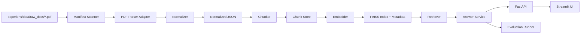
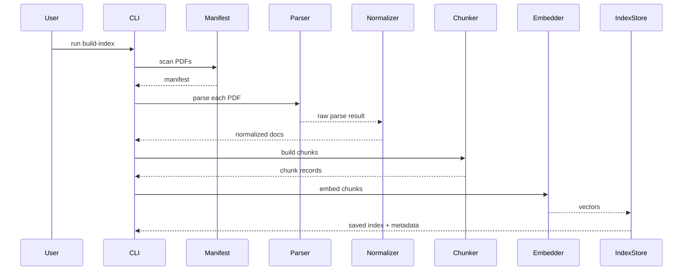
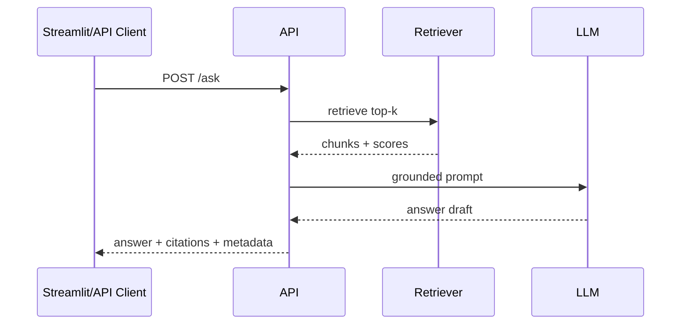
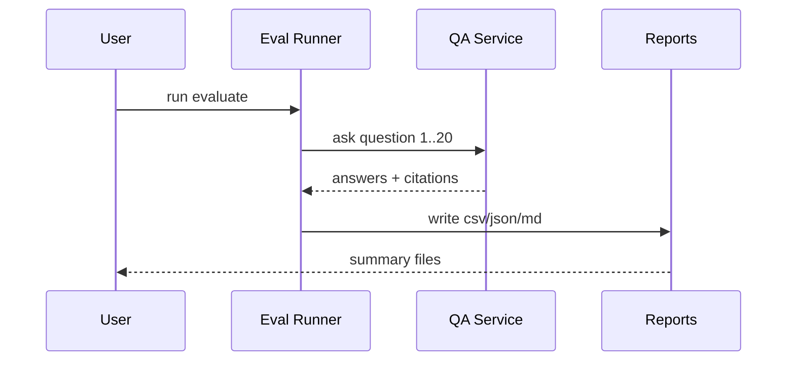

# Design Document

## Overview

PaperLens v1 的设计目标不是做一个“无限扩展的平台”，而是交付一个稳定、清晰、可演示、可评测的 PDF RAG 系统。系统围绕 `paperlens/` 目录组织，默认使用 API 调用的 embedding 模型和生成模型，通过解析层、标准化层、索引层、问答层和评测层完成端到端闭环。

这里的“多模态”采用务实定义：

- v1 必须覆盖 PDF 文本、章节结构、表格元数据和页码引用。
- v1 的解析接口要允许未来替换成更强的版面解析器或 VLM 方案。
- v1 不把 OCR、图片问答、扫描件修复列为上线阻塞项。

## Goals

1. 端到端跑通本地 PDF -> 结构化解析 -> chunk -> 向量索引 -> 问答 -> 评测。
2. 保证所有答案都能回溯到文档和页码。
3. 保证 20 题评测可以稳定复现。
4. 让项目代码结构足够清楚，适合写进 README 和简历。

## Non-Goals

1. 不在 v1 内实现微调训练。
2. 不在 v1 内实现复杂多租户或权限系统。
3. 不在 v1 内实现强依赖云平台的生产级部署。
4. 不在 v1 内追求所有 PDF 都解析完美，重点是对当前公开论文集稳定可用。

## Assumptions

1. 项目根目录为 `paperlens/`。
2. 输入语料已经放在 `paperlens/data/raw_docs/`。
3. 当前评测集已经放在 `paperlens/data/eval/questions.csv`。
4. 生成模型与 embedding 模型默认通过 API 调用，不要求本地训练。
5. 默认首选基础解析器跑通全链路，可选增强解析器用于提高结构化质量。

## Proposed Directory Layout

```text
paperlens/
  app/
    core/
      config.py
      logging.py
    models/
      schemas.py
    services/
      manifest_service.py
      parser_base.py
      pdf_parser_pymupdf.py
      pdf_parser_opendataloader.py
      normalizer.py
      eval_service.py
    rag/
      chunker.py
      embedder.py
      index_store.py
      retriever.py
      answer_service.py
    api/
      main.py
      routes.py
    cli/
      main.py
  ui/
    app.py
  data/
    raw_docs/
    parsed_docs/
      raw/
      normalized/
    chunks/
    indexes/
    eval/
  reports/
  scripts/
  tests/
```

说明：

- `services/` 负责文档侧流水线。
- `rag/` 负责 chunk、embedding、索引、检索、回答。
- `api/` 提供 FastAPI。
- `ui/` 提供 Streamlit。
- `tests/` 保留最小但关键的自动化测试。

## High-Level Architecture



## Core Design Decisions

### 1. 解析器做适配层，不把第三方库写死到主链路

定义统一解析接口：

```python
class PdfParser:
    def parse(self, pdf_path: str) -> dict:
        ...
```

建议至少提供两个实现：

- `PyMuPDFParser`
  默认实现，优先保证稳定与低门槛。
- `OpenDataLoaderPdfParser`
  可选增强实现，优先提高结构化质量。

无论使用哪一种解析器，输出都先进入标准化层，再进入 chunker。这样后续替换解析器不会影响索引和问答链路。

### 2. 统一标准化 schema 是整个项目的中心

标准化结果统一写到 `paperlens/data/parsed_docs/normalized/`。后续 chunker 只读取统一 schema，不直接读取第三方原始结果。

建议的标准化文档结构：

```json
{
  "doc_id": "layoutlm_1912.13318",
  "doc_name": "layoutlm_1912.13318.pdf",
  "title": "LayoutLM: Pre-training of Text and Layout for Document Image Understanding",
  "parser": "pymupdf",
  "page_count": 16,
  "pages": [
    {
      "page_num": 1,
      "elements": [
        {
          "element_id": "p1_e1",
          "type": "heading",
          "text": "LayoutLM: Pre-training of Text and Layout for Document Image Understanding",
          "bbox": [0, 0, 100, 30],
          "section_path": ["Title"]
        },
        {
          "element_id": "p1_e2",
          "type": "paragraph",
          "text": "Pre-training of text and layout information ...",
          "bbox": [0, 40, 400, 220],
          "section_path": ["Abstract"]
        }
      ]
    }
  ],
  "metadata": {
    "source_path": "paperlens/data/raw_docs/layoutlm_1912.13318.pdf",
    "file_hash": "sha256:...",
    "parsed_at": "2026-03-31T15:00:00"
  }
}
```

### 3. Chunk 以“结构优先”而不是“纯字符切块”生成

为了保证引用和检索效果，chunk 不应直接按固定长度硬切全文，而应优先按以下顺序组装：

1. 章节标题。
2. 标题下连续段落。
3. 表格或列表作为相对独立单元。
4. 超长内容再执行二次切分。

默认策略建议：

- 目标长度：`1000-1500` 字符。
- overlap：`150-250` 字符。
- 表格元素尽量单独成块。
- chunk 保留跨页信息。

建议的 chunk 记录结构：

```json
{
  "chunk_id": "layoutlm_1912.13318_c0007",
  "doc_id": "layoutlm_1912.13318",
  "doc_name": "layoutlm_1912.13318.pdf",
  "page_start": 2,
  "page_end": 3,
  "section_title": "2 Related Work",
  "element_types": ["heading", "paragraph"],
  "text": "...",
  "char_count": 1180
}
```

### 4. 检索链路以“向量检索优先，回答必须引用”为原则

v1 主链路采用：

1. 对问题做 embedding。
2. 从 FAISS 中召回 Top-K chunk。
3. 组织提示词，请模型在给定上下文内作答。
4. 将被引用的 chunk 映射回文档名和页码。

v1 不把复杂 reranker、知识图谱检索和多轮 agent 规划列为必做项。这样可显著提高完成率。

### 5. 回答接口必须支持无法回答分支

PaperLens 不是普通聊天机器人。对于标准 20 题中的“无法回答题”，系统必须支持显式拒答。

回答服务的输出建议统一为：

```json
{
  "question": "Self-RAG 和原始 RAG 的核心差别是什么？",
  "answer": "Self-RAG 在生成过程中引入了反思与检索控制机制。",
  "citations": [
    {
      "doc_name": "self_rag_2310.11511.pdf",
      "page_num": 1,
      "chunk_id": "self_rag_2310.11511_c0002",
      "quote": "Self-RAG ..."
    }
  ],
  "retrieval": {
    "top_k": 5,
    "hit_count": 5,
    "latency_ms": 1320
  },
  "answerable": true,
  "failure_reason": null
}
```

若无法回答：

```json
{
  "question": "这些论文的作者邮箱分别是什么？",
  "answer": "当前检索到的文档内容不足以可靠回答这个问题。",
  "citations": [],
  "retrieval": {
    "top_k": 5,
    "hit_count": 2,
    "latency_ms": 1100
  },
  "answerable": false,
  "failure_reason": "insufficient_context"
}
```

## Component Design

### Manifest Scanner

职责：

- 扫描 `paperlens/data/raw_docs/`。
- 计算文件哈希、页数、大小、状态。
- 生成文档清单。

输入：

- 本地 PDF 文件。

输出：

- `paperlens/data/eval/doc_manifest.csv` 或新的 manifest JSON/CSV。

### Parser Adapter Layer

职责：

- 屏蔽 `PyMuPDF` 与 `OpenDataLoader PDF` 的差异。
- 输出统一的原始解析结果。

接口建议：

```python
class PdfParser:
    name: str

    def parse(self, pdf_path: str) -> dict:
        raise NotImplementedError
```

### Normalizer

职责：

- 将解析器输出转换为统一 schema。
- 清洗空段落、异常坐标、重复文本。
- 统一元素类型命名。

输入：

- 解析器原始结果。

输出：

- `NormalizedDocument`

### Chunker

职责：

- 读取标准化文档。
- 按结构合并内容。
- 生成 chunk 及其元数据。

关键规则：

- 标题尽量与其后段落一起成块。
- 表格保持独立。
- 记录 chunk 覆盖的页码范围。

### Embedder

职责：

- 读取 chunk。
- 调用 embedding 模型。
- 返回向量矩阵。

接口建议：

```python
class Embedder:
    def embed_texts(self, texts: list[str]) -> list[list[float]]:
        ...

    def embed_query(self, text: str) -> list[float]:
        ...
```

### Index Store

职责：

- 保存 FAISS 索引。
- 保存 `chunk_id -> metadata` 的映射。
- 提供重建和加载逻辑。

输出建议：

- `paperlens/data/indexes/faiss.index`
- `paperlens/data/indexes/chunk_metadata.jsonl`
- `paperlens/data/indexes/build_info.json`

### Retriever

职责：

- 对问题向量化。
- 执行 Top-K 相似度检索。
- 返回结构化候选列表。

返回字段建议：

- `chunk_id`
- `score`
- `doc_name`
- `page_start`
- `page_end`
- `text`

### Answer Service

职责：

- 构造 system prompt 和 user prompt。
- 将检索结果注入上下文。
- 生成答案。
- 执行引用映射和无法回答判断。

关键约束：

- 提示词必须要求模型“仅基于上下文作答”。
- 提示词必须要求模型“无法回答时明确说明”。
- 系统输出必须可序列化。

### Evaluation Service

职责：

- 读取 `paperlens/data/eval/questions.csv`
- 逐题调用问答服务
- 计算汇总指标
- 输出明细和总结

建议指标：

- `answered_count`
- `abstained_count`
- `citation_present_rate`
- `doc_hit_rate`
- `page_hit_rate`
- `avg_latency_ms`

### FastAPI Layer

最小接口建议：

#### `GET /health`

返回：

```json
{"status": "ok"}
```

#### `GET /documents`

返回文档状态列表：

```json
{
  "count": 10,
  "documents": [
    {
      "doc_name": "layoutlm_1912.13318.pdf",
      "page_count": 16,
      "indexed": true
    }
  ]
}
```

#### `POST /ask`

请求：

```json
{
  "question": "LayoutLM 和 LayoutLMv3 的主要差别是什么？",
  "top_k": 5
}
```

响应：

```json
{
  "answer": "...",
  "answerable": true,
  "citations": [],
  "retrieval": {}
}
```

### Streamlit UI

页面最小构成：

1. 项目标题和系统状态。
2. 已加载文档列表。
3. 提问输入框。
4. 答案显示区。
5. 引用区。
6. 检索调试区。

不建议在 v1 中加入过多页面跳转。单页应用最利于演示和排错。

## End-to-End Flows

### Flow 1: 索引构建



### Flow 2: 问答



### Flow 3: 评测



## Configuration Design

建议统一配置项：

```text
OPENAI_API_KEY=
OPENAI_BASE_URL=
LLM_MODEL=
EMBEDDING_MODEL=
PARSER_BACKEND=pymupdf
TOP_K=5
CHUNK_MAX_CHARS=1400
CHUNK_OVERLAP=200
RETRIEVAL_SCORE_THRESHOLD=0.25
```

配置加载原则：

1. `.env` 和环境变量统一由 `config.py` 读取。
2. 业务代码不直接读 `os.environ`。
3. 缺失关键配置时尽早失败。

## Error Handling

### 文档处理错误

- 文件损坏：标记为 `parse_failed`
- 页数读取失败：记录日志并跳过
- 第三方解析器缺失：自动降级到默认解析器

### 索引错误

- embedding 模型配置错误：立即终止并提示检查 `.env`
- 索引文件缺失：API 和 UI 明确提示“请先构建索引”

### 问答错误

- 检索为空：返回 `answerable=false`
- 模型调用异常：返回可读错误，不输出假答案
- 引用映射失败：保留答案失败状态并记录日志

### 评测错误

- 单题失败：记录到结果表，不中断整批
- 汇总失败：保留逐题结果，允许后续重新汇总

## Testing Strategy

### 单元测试

重点覆盖：

1. 配置加载。
2. 标准化 schema 序列化。
3. chunk 生成规则。
4. 引用映射逻辑。

### 集成测试

重点覆盖：

1. 从 1 份 PDF 跑完整解析和 chunk 流水线。
2. 构建索引后执行单题问答。
3. API `GET /health` 和 `POST /ask`。

### 评测验证

重点覆盖：

1. 20 题完整跑通。
2. 至少产出逐题 CSV 和汇总 Markdown。
3. 无法回答题能正确进入拒答分支。

## Observability and Outputs

建议输出：

- `paperlens/reports/eval_results.csv`
- `paperlens/reports/eval_summary.md`
- `paperlens/reports/run_log.txt`

日志最少要能回答三件事：

1. 哪份文档处理失败了。
2. 当前索引是基于哪批文档生成的。
3. 某个答案引用了哪些 chunk 和页码。

## Future Extensions

这些能力在 v1 设计中预留接口，但不作为首发阻塞项：

1. OCR 解析器适配。
2. VLM 驱动的页面级理解。
3. BM25 或 reranker 混合检索。
4. 文档上传与异步处理。
5. 更多评测集与自动报告图表。
