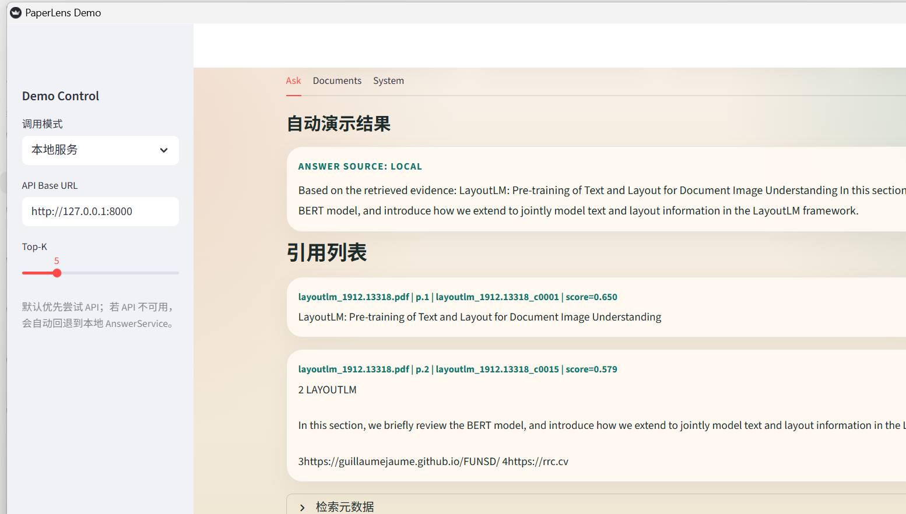

# PaperLens

PaperLens 是一个本地可运行的论文文档问答 Demo。它把 `data/raw_docs/` 下的 PDF 论文解析为结构化文本，构建检索索引，并通过 FastAPI 和 Streamlit 提供带引用的问答能力。

当前仓库已经包含一套可直接演示的数据、索引、评测脚本和界面产物，适合继续做 RAG、文档理解和论文问答方向的实验。



## 功能概览

- 扫描并管理本地 PDF 文档清单
- 基于 PyMuPDF 解析 PDF，并统一输出标准化文档结构
- 按章节和段落生成检索用 chunk
- 构建本地向量索引并执行 Top-K 检索
- 生成带文档名、页码和引用片段的回答
- 支持无法回答分支，避免无依据编造
- 提供 FastAPI 接口和 Streamlit 演示页面
- 提供 20 题批量评测脚本和评测结果产物
- 提供一键提交并推送到 GitHub 的同步脚本

## 当前状态

- 文档规模：10 篇 PDF
- 评测题目：20 题
- 最新本地评测结果（2026-04-02，当前工作站 `.env` 已接入真实 LLM）：
  - Answered: `18 / 20`
  - Refused: `2 / 20`
  - Errors: `0 / 20`
  - Citation rate: `90.00%`
  - Expected doc hit rate: `100.00%`
  - Answerability match rate: `100.00%`
  - Avg latency: `4907.60 ms`

运行模式说明：

- 仓库默认能力仍然是“无凭证也可运行 Demo”：如果没有 `OPENAI_API_KEY` / `LLM_MODEL`，PaperLens 会自动回退到 extractive fallback
- 当前这台开发机在 `2026-04-02` 的本地 `.env` 已配置 OpenAI-compatible 网关与 `gpt-5.4`，所以本仓库里的最新 smoke / eval 产物已经反映真实 LLM 优先、extractive rescue 兜底的运行方式

相关产物：

- 界面截图：`screenshots/paperlens-demo-ui.png`
- 评测摘要：`reports/eval_summary.md`
- 评测明细：`reports/eval_results.csv`
- 运行日志：`reports/run_log.txt`

## 项目结构

```text
paperlens/
├─ app/                  # 后端核心代码
├─ data/                 # PDF、评测集、索引和中间产物
├─ docs/                 # 项目文档与问题日志
├─ reports/              # 评测摘要、运行结果、演示材料
├─ screenshots/          # 界面截图
├─ scripts/              # 构建、评测、同步脚本
├─ tests/                # 单元测试与 smoke tests
├─ ui/                   # Streamlit 界面
├─ README.md
└─ requirements.txt
```

## 环境准备

建议在 Windows 下使用本地虚拟环境：

```powershell
python -m venv .venv
.\.venv\Scripts\python -m pip install -r requirements.txt
```

可选增强依赖：

```powershell
.\.venv\Scripts\python -m pip install faiss-cpu opendataloader-pdf
```

说明：

- 默认流程不依赖 `faiss-cpu` 也能运行
- 若安装了 `faiss-cpu`，后续可以切换到更接近生产形式的向量检索后端
- 若安装了 `opendataloader-pdf`，可以启用更强的 PDF 解析路径

## 真实 LLM 配置

如果你希望 Demo 优先走真实 LLM 回答链路，可以在 `.env` 中配置：

```env
ANSWER_BACKEND=auto
OPENAI_API_KEY=your-api-key
OPENAI_BASE_URL=
LLM_MODEL=your-model-id
LLM_TEMPERATURE=0
LLM_MAX_CONTEXT_CHUNKS=6
LLM_MAX_OUTPUT_TOKENS=400
```

说明：

- `ANSWER_BACKEND=auto`：有完整 LLM 配置时走真实模型，否则自动回退到 extractive fallback
- `ANSWER_BACKEND=openai`：强制要求真实 LLM 配置完整；若缺少 API Key 或模型名，会直接报配置错误
- `ANSWER_BACKEND=extractive`：始终使用本地抽取式回答
- `OPENAI_BASE_URL` 可留空，也可填兼容 OpenAI API 的代理 / 网关地址
- 如果 `OPENAI_BASE_URL` 只填了裸域名或根路径（例如 `https://example.com`），PaperLens 会自动规范为 `https://example.com/v1`；已经带自定义路径的网关地址会原样保留

可用下面的命令检查当前回答链路是否真的已经切到 LLM：

```powershell
.\.venv\Scripts\python scripts\run_qa_smoke.py --require-llm
```

## 快速开始

### 1. 构建文档清单

```powershell
.\.venv\Scripts\python scripts\build_manifest.py
```

输出：

- `reports/doc_manifest_runtime.csv`
- `logs/manifest_scan.jsonl`

如果遇到坏文件或环境缺依赖，manifest 现在会保留显式 `status` / `error_code`，并把扫描过程写入日志，方便排查。

### 2. 构建索引

```powershell
.\.venv\Scripts\python scripts\build_chunks.py
```

### 3. 构建索引

```powershell
.\.venv\Scripts\python scripts\build_index.py
```

### 4. 运行问答 smoke test

```powershell
.\.venv\Scripts\python scripts\run_qa_smoke.py --include-default-unanswerable
```

## 启动 API

```powershell
.\.venv\Scripts\python -m uvicorn app.api.main:app --reload
```

接口：

- `GET /health`
- `GET /documents`
- `POST /ask`

## 一键启动 API + UI

Windows 下可以直接使用仓库内置脚本，一次拉起 API 和 Streamlit，并自动用 Chrome 打开页面：

```powershell
.\scripts\start_demo.ps1
```

如果更习惯双击，可直接运行：

```text
scripts\start_demo.cmd
```

默认行为：
- 启动 `uvicorn`（`http://127.0.0.1:8000`）
- 启动 Streamlit（`http://127.0.0.1:8501/`）
- 打开 `?mode=api` 页面，并自动把 UI 的 API 地址指向当前启动的端口
- 如果目标 `API` 端口上已经是可复用的 PaperLens 服务，脚本会直接复用现有 API，只补起缺失的 UI

常用参数：

```powershell
.\scripts\start_demo.ps1 -NoBrowser
.\scripts\start_demo.ps1 -ApiPort 8001 -UiPort 8502
.\scripts\start_demo.ps1 -UiMode auto
.\scripts\start_demo.ps1 -DryRun
```

## 一键停止 API + UI

如果是通过一键启动脚本拉起的演示服务，可以直接使用配套停止脚本：

```powershell
.\scripts\stop_demo.ps1
```

如果更习惯双击，可直接运行：

```text
scripts\stop_demo.cmd
```

常用参数：

```powershell
.\scripts\stop_demo.ps1 -DryRun
.\scripts\stop_demo.ps1 -ApiPort 8001 -UiPort 8502
```

## 启动 Streamlit 演示界面

```powershell
.\.venv\Scripts\python -m streamlit run ui/app.py
```

演示地址示例：

```text
http://127.0.0.1:8501/?question=LayoutLM%E5%9C%A8%E6%96%87%E6%A1%A3%E7%90%86%E8%A7%A3%E9%87%8C%E6%9C%80%E6%A0%B8%E5%BF%83%E7%9A%84%E5%BB%BA%E6%A8%A1%E5%AF%B9%E8%B1%A1%E6%98%AF%E4%BB%80%E4%B9%88%EF%BC%9F&autorun=1&mode=local&top_k=5
```

界面支持：

- 自动模式、本地模式、API 模式
- 引用列表展示
- 无法回答提示
- 演示自动运行参数

## 运行完整评测

```powershell
.\.venv\Scripts\python scripts\run_eval.py
```

输出文件：

- `reports/eval_results.csv`
- `reports/eval_summary.md`
- `reports/run_log.txt`

## 数据说明

`data/` 目录已经包含可直接使用的演示数据：

- `data/raw_docs/`：10 篇公开 PDF 论文
- `data/eval/questions.csv`：20 题机器可读评测集
- `data/eval/questions_answers_readable.md`：人工可读版问答
- `data/eval/doc_manifest.csv`：论文元信息

如果只想了解数据集内容，可以查看 [data/README.md](data/README.md)。

## GitHub 同步

仓库内置了一键同步脚本：

```powershell
.\scripts\git_sync.ps1 -Message "docs: rewrite readme"
```

默认行为：

- 自动 `git add -A`
- 自动创建 commit
- 若远程分支已前进，会先 `fetch + rebase`
- 最后推送到 `origin`

常用参数：

```powershell
.\scripts\git_sync.ps1 -Message "docs: rewrite readme" -SkipTests
.\scripts\git_sync.ps1 -Message "wip: local snapshot" -NoPush
```

## 已知限制

- 当前默认索引后端仍是 JSON 向量存储，不是 FAISS
- 未配置真实 LLM 凭证时，回答主要依赖 extractive fallback，答案风格更偏“证据抽取”
- chunk 切分质量还有继续优化空间，复杂问题的回答稳定性仍能继续提升

## 适合继续演进的方向

- 接入更强的 embedding 或 reranker
- 切换到 FAISS 检索后端
- 优化表格、跨页和长文本切块
- 接入真实 LLM 生成更自然的回答
- 增加更多论文和更系统的评测集
